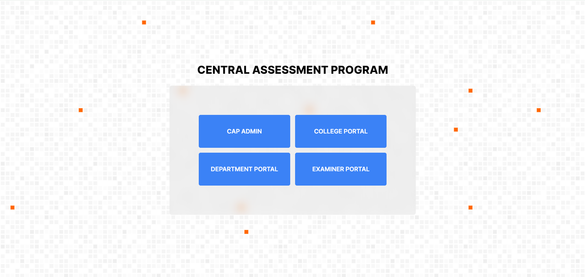

# Central Assessment Program

## Overview
Central Assessment Program is designed to manage and evaluate various assessments efficiently. This repository contains both backend and frontend code for the application.

## Requirements
- [Node.js](https://nodejs.org/) (version 14 or higher)
- [MongoDB](https://www.mongodb.com/try/download/community) client installed and running

### Design File
 - [Figma File](https://www.figma.com/design/F78T8Fz0gPckKMksBQiWqM/CAP?node-id=0-1&t=jJ0Ytpvr5hPdrfw7-1)

## Installation

### Backend

1. Navigate to the `backend` directory:
    ```bash
    cd backend
    ```

2. Install the dependencies:
    ```bash
    npm install
    ```

3. Set up the environment variables. Create a `.env` file in the `backend` directory and add the necessary variables:
    ```env
    PORT=your_port_number
    DB_URL=your_database_url
    ```

4. Start the backend server:
    ```bash
    npm start
    ```

### Frontend

1. Navigate to the `frontend` directory:
    ```bash
    cd frontend
    ```

2. Install the dependencies:
    ```bash
    npm install
    ```

3. Set up the environment variables. Create a `.env` file in the `frontend` directory and add the necessary variables:
    ```env
    REACT_APP_API_URL=your_backend_api_url
    ```

4. Start the frontend development server:
    ```bash
    npm start
    ```

## Project Screenshots

Here are some screenshots of the application:
<!-- 



 -->

<table>
  <tr>
    <td></td>
    <td></td>
  </tr>
  <tr>
    <td></td>
    <td></td>
  </tr>
  <tr>
    <td></td>
    <td></td>
  </tr>
  <tr>
    <td></td>
    <td></td>
  </tr>
</table>

For more screenshots, visit the [screenshots folder](screenshots/README.md).


## Contributing

1. Fork the repository.
2. Create your feature branch: `git checkout -b feature/my-new-feature`.
3. Commit your changes: `git commit -m 'Add some feature'`.
4. Push to the branch: `git push origin feature/my-new-feature`.
5. Submit a pull request.

## License

This project is licensed under the MIT License - see the [LICENSE](LICENSE) file for details.
